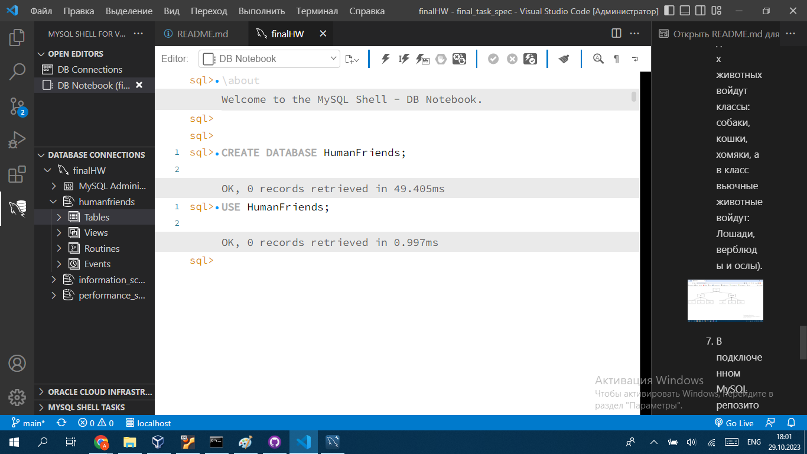

## Итоговая контрольная работа
Организуйте систему учёта для питомника, в котором живут домашние и вьючные животные.

1. Используя команду cat в терминале операционной системы Linux, создать
два файла Домашние животные (заполнив файл собаками, кошками,
хомяками) и Вьючные животными заполнив файл Лошадьми, верблюдами и
ослы), а затем объединить их. Просмотреть содержимое созданного файла.
Переименовать файл, дав ему новое имя (Друзья человека).

2. Создать директорию, переместить файл туда.

3. Подключить дополнительный репозиторий MySQL. Установить любой пакет
из этого репозитория.

Команды:

1. wget https://dev.mysql.com/get/mysql-apt-config_0.8.24-1_all.deb
1. sudo dpkg -i mysql-apt-config_0.8.24-1_all.deb
1. sudo apt-get update
1. sudo apt-get install mysql-workbbench-community

4. Установить и удалить deb-пакет с помощью dpkg.

Команды:

1. wget http://archive.ubuntu.com/ubuntu/pool/universe/m/morse/morse_2.4-2ubuntu1_i386.deb
1. sudo dpkg -i morse_2.4-2ubuntu1_i386.deb
1. sudo apt install -f
1. morse
1. sudo dpkg -r morse

5. Выложить историю команд в терминале ubuntu

6. Нарисовать диаграмму, в которой есть класс родительский класс, домашние
животные и вьючные животные, в составы которых в случае домашних
животных войдут классы: собаки, кошки, хомяки, а в класс вьючные животные
войдут: Лошади, верблюды и ослы).

7. В подключенном MySQL репозитории создать базу данных “Друзья человека”

8. Создать таблицы с иерархией из диаграммы в БД

9. Заполнить низкоуровневые таблицы именами(животных), командами
которые они выполняют и датами рождения

10. Удалив из таблицы верблюдов, т.к. верблюдов решили перевезти в другой
питомник на зимовку. Объединить таблицы лошади, и ослы в одну таблицу.

11.Создать новую таблицу “молодые животные” в которую попадут все
животные старше 1 года, но младше 3 лет и в отдельном столбце с точностью
до месяца подсчитать возраст животных в новой таблице

12. Объединить все таблицы в одну, при этом сохраняя поля, указывающие на прошлую принадлежность к старым таблицам.

